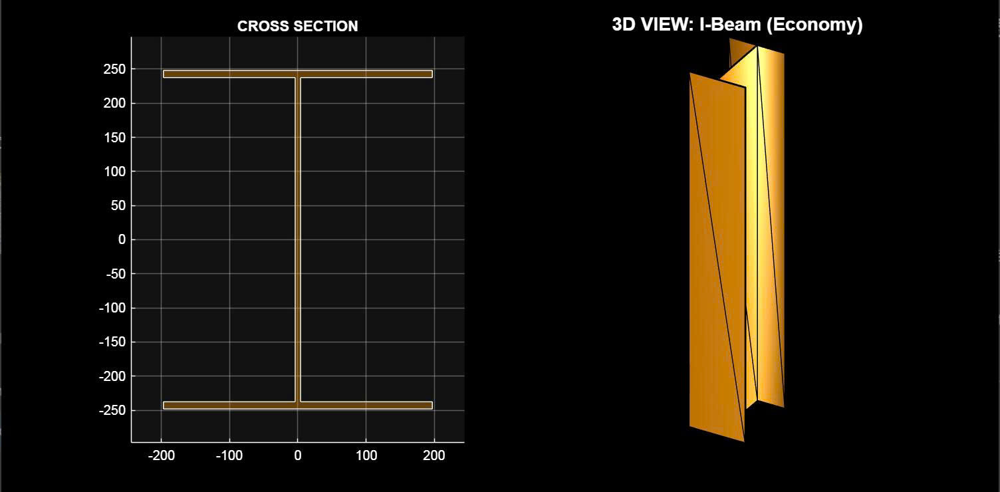
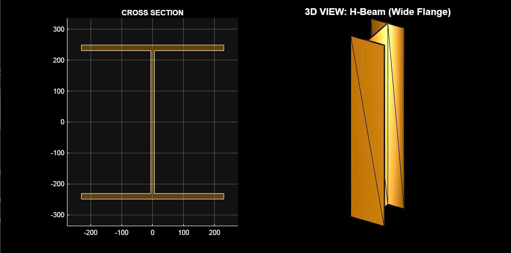
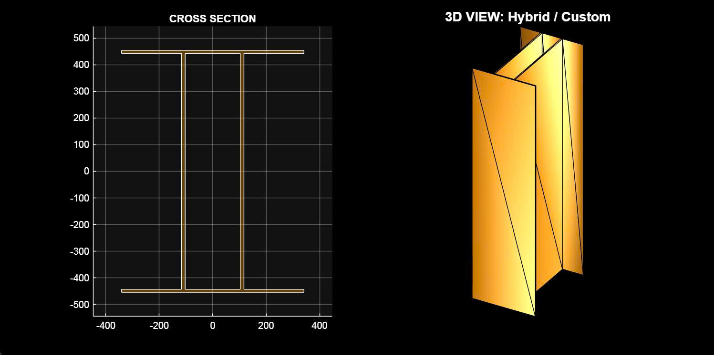
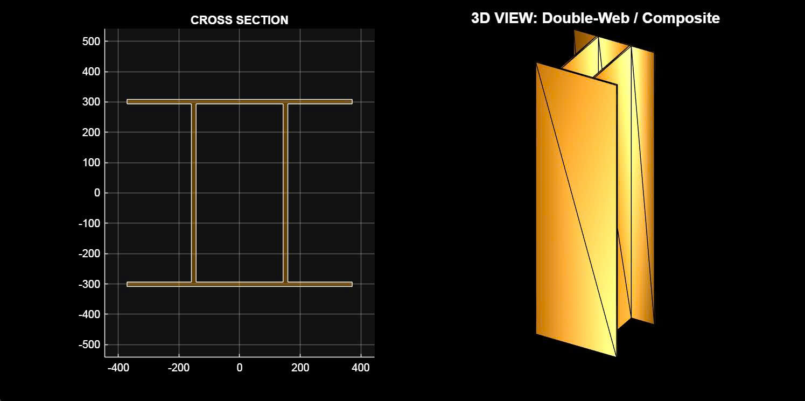

# AI-Morphing-Beam-Optimizer
A MATLAB-based Genetic Algorithm that optimizes steel beam cross-sections for various loading scenarios (Moment, Shear, Torsion).
# 🏗️ AI-Driven Morphing Beam Optimizer

  

## 📖 Project Overview
This project explores the potential of **Artificial Intelligence (Genetic Algorithms)** in Structural Engineering. Instead of selecting standard steel profiles from a catalog, the algorithm "morphs" the cross-section geometry to find the optimal shape for specific load cases.

The tool aims to minimize mass (cost) while satisfying strict engineering constraints:
* **Stress Check:** Von Mises (Yield Strength S355).
* **Stability:** Global Buckling & Deflection Limits ($L/250$).
* **Manufacturability:** Welding gaps, plate thickness constraints.
* **Torsion Physics:** Automatic penalty for open sections under high torsion.

---

## 🚀 The "Four Great Beams" (Key Results)

The algorithm was tested on 4 distinct scenarios, successfully rediscovering classical structural shapes without human intervention.

### 1. The Economy I-Beam (Pure Bending)
* **Scenario:** High Bending Moment ($M_x$), Zero Torsion.
* **AI Solution:** A slender **I-Beam** with thin webs.
* **Why:** This is the most efficient shape for bending. The AI automatically closed the web gap to zero.

### 2. The Constrained H-Beam (Height Limited)
* **Scenario:** Height restricted ($h < 500mm$), Heavy Shear.
* **AI Solution:** A squat, wide **H-Beam**.
* **Why:** Since it couldn't grow vertically, the AI expanded horizontally to maintain Moment of Inertia ($I_x$).

### 3. The Arup Box Girder (High Torsion)
* **Scenario:** Extreme Torsion ($M_y$) + Bending.
* **AI Solution:** A **Wide Box Girder** (Webs separated).
* **Why:** Open sections (I-beams) fail under torsion. The algorithm's "Torsion Police" heuristic forced the webs apart to maximize the torsional constant ($J$).

### 4. The Double-Web Transfer Beam (Extreme Shear)
* **Scenario:** Massive Shear Force ($V = 3500 kN$).
* **AI Solution:** A **Double-Web Composite Section** (closely packed webs).
* **Why:** A single web would require impractical thickness. The AI used two moderately thick webs to distribute shear stress effectively.

---

## 🧠 Algorithmic Logic (How it works)

### The "Magnetic Snap" & "Torsion Police"
To bridge the gap between continuous optimization and practical engineering, I implemented custom heuristics:
1.  **Magnetic Snap:** If the gap between webs is small (< 25mm), the algorithm forces it to 0mm (creating a standard I-Beam) to avoid manufacturing issues.
2.  **Torsion Police:** A dynamic penalty function that detects high Torsion/Bending ratios. It imposes heavy penalties on open sections, effectively "teaching" the AI that I-Beams cannot survive twisting forces.

### Objective Function
$$Cost = Mass + \sum (Penalties)$$
Where penalties include:
* $\sigma_{vm} > f_y$ (Yielding)
* $\Delta > L/250$ (Deflection)
* $\lambda > 150$ (Buckling)
* Gap constraints (Manufacturing)

---

*Created by [Owen Nguyen] - 2026*
